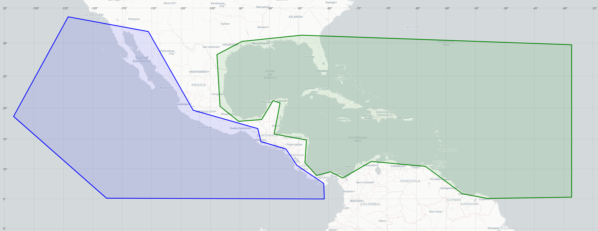
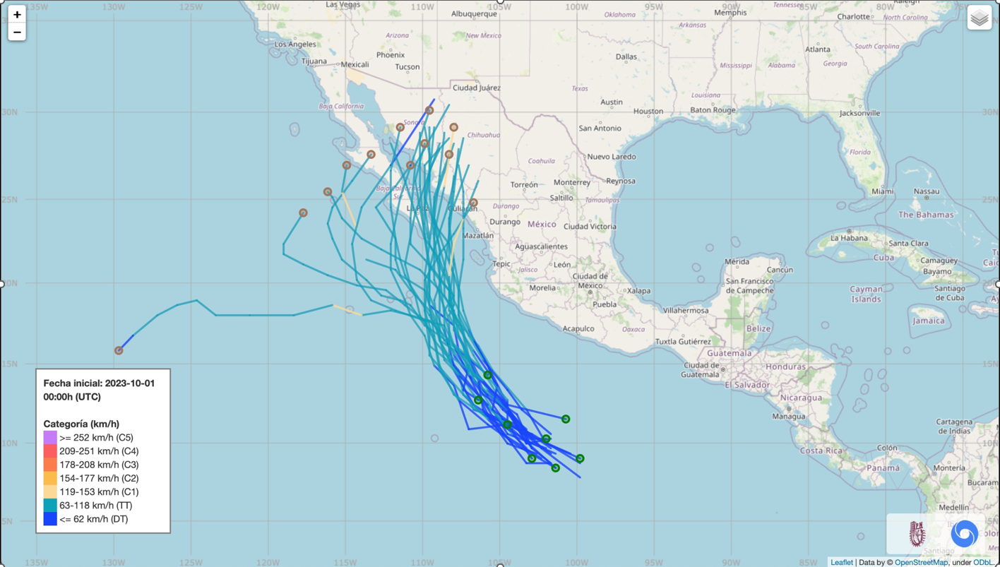
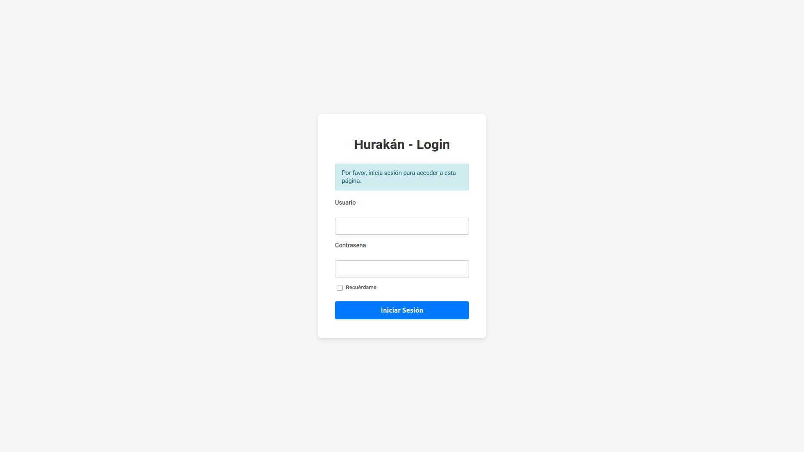
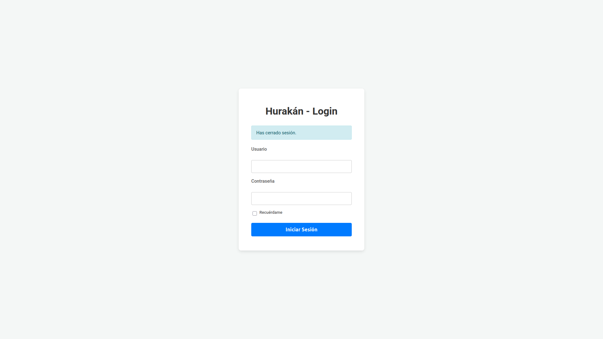
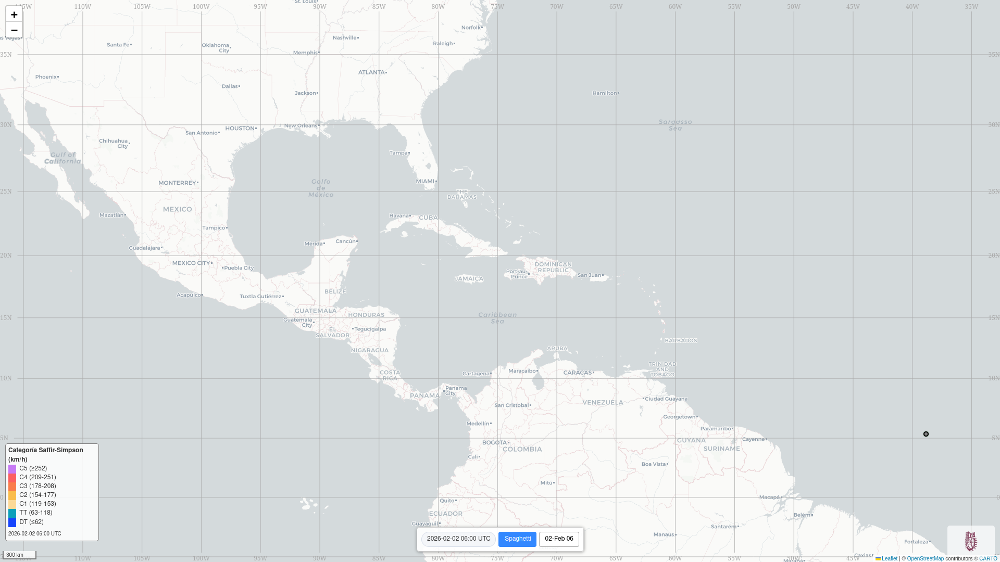
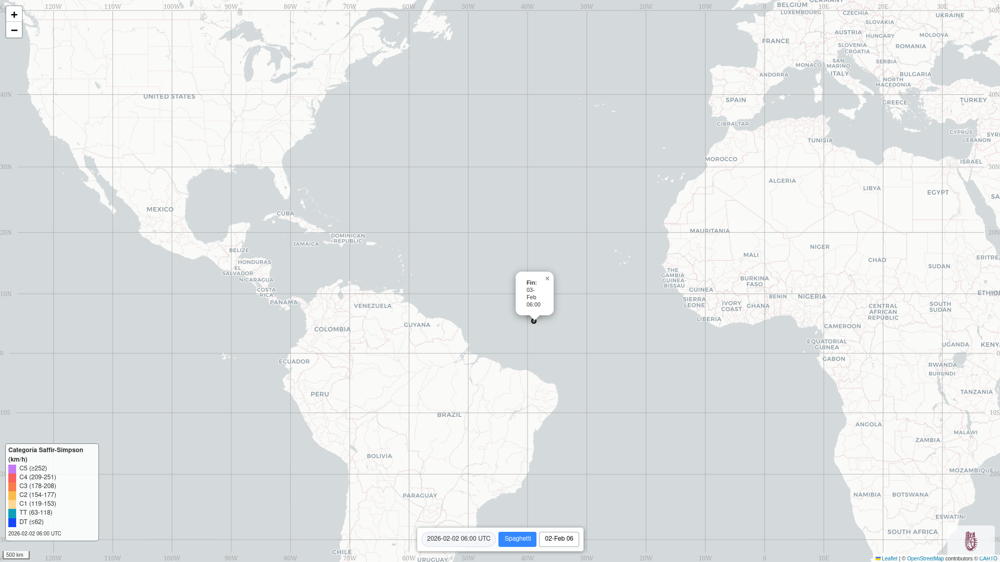
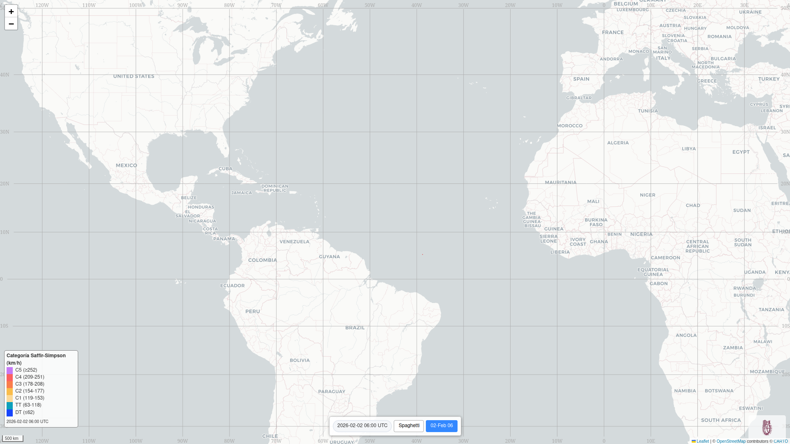
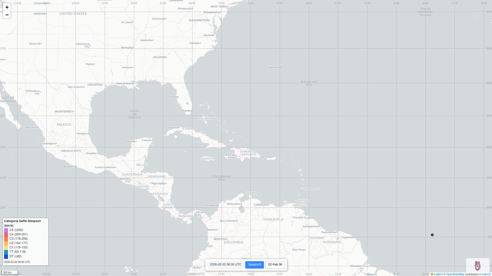
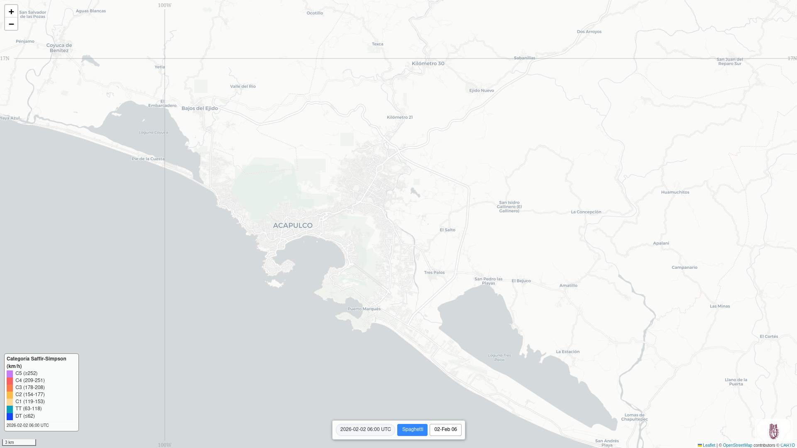

# System User Manual

## Introduction
The Hurricane system facilitates the detection and monitoring of tropical cyclones through the visualization and analysis of potential meteorological phenomena, using detailed current information (temperature, pressure, humidity, and wind conditions in basins of interest) and its temporal processing. The main objective is to detect and monitor potential storms that could affect living conditions in coastal areas.

Figure 1. The two basins of interest: the Eastern Pacific and the North Atlantic  

Currently, there are two basins of interest: the Eastern Pacific and the Western Atlantic, both close to the coastal areas of Mexico in the Pacific and Atlantic Oceans, as shown in the figure 1.

Historically, tropical cyclones occur in the basins of interest between June and November, with the highest incidence between August and September.

The information entered into the system consists of meteorological observations of the basins of interest at a certain resolution (10 m), and must be updated every 12 hours. It should be noted that this information is available year-round, so it can be used any day of the year.

## Requirements
To properly visualize the possible trajectories and their cones of uncertainty for the probabilistic atmospheric data, the following are required:
- A web server with the Hurakán platform (see [Installation manual](../README.md) ) posting at specific URL
- A client web browser with Javascript enabled (Google Chrome v146, Safari v17, Microsoft Edge v145, or Mozilla Firefox v148 are recommended)
- System access credentials (the Hurakán system administrator can provide these credentials; see [Login and logout](#loginlogout))

## Available Information and Context Window
Given the probabilistic nature of its data, the Hurakán system generates possible information within a data window of up to 15 days for 50 different predictors (if possible). This means that for each possible meteor, from 0 up to 50 different trajectories could be generated, covering up to 15 days from the current date.

Figuer 2. 20231003 Tropical Cyclone Lidia. Example of the interactive hurricane system map. Given data for a date such as October 1, 2023, the possible future trajectories within the 15-day forecast period are shown. Each trajectory corresponds to a different predictor, which may develop on different dates in the future. Each trajectory shows the storm's speed on a specific date in color.

The implications for the visualization can be difficult to follow. The spaghetti_example figure 2 shows an example of such a visualization.

## Accesing Hurakán
Suppose the web server platform posts at URL https://hurakan.cicataqro.ipn.mx . In the **address bar** of the web browser write off `https://hurakan.cicataqro.ipn.mx` and press `<enter>`

List of possible URL to access services in Hurakán
- `https://hurakan.cicataqro.ipn.mx` - Initial access or `login` window
- `https://hurakan.cicataqro.ipn.mx/login` - `login` window
- `https://hurakan.cicataqro.ipn.mx/logout` - `logout` window
- `https://hurakan.cicataqro.ipn.mx/health` - `status` window

## Login and logout 
Hurakán mantains controlled access because of the metereological information and their possible consecuences. The adminstrator must give, for each specific person, a user name and password.
When accesing the initial window or the `login` window, you must input your credentials in each input field, as shown in the next figure:

Figure 3. Login window

and the next window shows the map for the data available and allows interaction with the system.

When finish using Hurakán, the web browser can be closed or type in the address bar `https://hurakan.cicataqro.ipn.mx/logout` . The window shows:

Figure 4. Logout window

## Activities
In the Hurricane system, given the available information (see get_raw_data), the following activities can be performed:
- Select the date of the data to be reviewed
- Given a date, the possible trajectories will appear, using two formats:

Figure 5. The Spaghetti button shows/occults the data group by individual forecast trajectories (from 0 up to 50). Sometimes there aren't data to show, it depends on the metereological data from de day selected.

  - Spaghetti: all identified trajectories are shown, indicating the probable speed of the meteor, its probable starting point, and its probable ending point given the specific date. To facilitate visualization, a trajectory can be selected at its ending point, and the date information at that point will be displayed.

Figure 6. Spaghetti info for each possible trajectory. The info is shown at the initial and ending point of the tarjectory.

  - Date: the cone of uncertainty is displayed.

Figure 7. Overall possible trajectory for the date selected. The button(s) with the date(s) can shown a forecast of the trajectory ending in the date displayed.

Figure 8. The size of the scale in the map is shown in the left down corner, below the Saffir-Simpson scale.

- Interactive visualization. On the map, the central point can be moved, and zooming in or out can be done within a range of 1000 km to 10 m

Figure 9. The size of the scale in the map can be reduced with the `Zoom in` button at the right top corner with the `+` sign or the mouse wheel.

Figure 10. The size of the scale in the map can be augmented with the `Zoom out` button at the right top corner with the `-` sign or the mouse wheel.

## Interface description

<!-- The interface is divided into two main windows:

- Left side window or "selector". Here you can specify the date of the atmospheric data to be used (with possible predictions up to 15 days later, if supported by the data).

- Right-hand side window or "map". A world map is displayed showing the possible meteors that support the selected meteorological data.

### Selector Window
-->

A world map is displayed showing the possible meteors that support the selected meteorological data.

### Map Window

Map Window Elements:

Figure 11. The Saffir-Simpson scale showns several categories of wind speed with a key and color.

- Saffir-Simpson Category Speed ​​Scale. Displays meteor speeds using colors.
- Central panel with buttons. Displays the date of the data used, a Spaghetti button (to show all possible identified trajectories), and date buttons for each possible trajectory that could lead to a tropical cyclone (showing the date of the event, the possible trajectory using the Saffir-Simpson scale colors, the starting and ending points of that trajectory, and information at the ending point).

Figure 12. The map can be moved and scale to see the territory.

- World Map. It identifies the global position of trajectories, with a resolution of 10m to 1000km, allowing for precise trajectory tracking. The map center can be moved, and from there, zoom in (up to 10m) or zoom out (up to 1000km).
- There is an "Info" tab that summarizes all the possible identified trajectories.

## Examples of detection and tracking

In this section, several cases are analyzed to demonstrate hurricane capabilities. To identify tropical cyclones, the nomenclature used by NOAA and NHC for the genesis of a tropical cyclone is employed, indicating the year (YYYY), the day of the year (DDD), the hemisphere (N or S), the latitude in degrees (LLL), and the longitude in degrees (HHH); the name assigned to the storm is also used.

### Tropical Cyclone 2023294N09264 (Otis)

Figure 12. 20231001 Tropical Cyclone Otis.

- Category 5 hurricane (SSHWS)
- Duration: October 22 – October 25
- Peak intensity: 165 mph (270 km/h) (1-min); 922 mbar (hPa) [from Wikipedia](https://en.wikipedia.org/wiki/Hurricane_Otis)

### Tropical Cyclone Lidia

Figure 13. 20231003 Tropical Cyclone Lidia.

- Category 4 hurricane (SSHWS)
- Duration: October 3 – October 11
- Peak intensity: 140 mph (220 km/h) (1-min); 942 mbar (hPa) [from Wikipedia](https://en.wikipedia.org/wiki/Hurricane_Lidia_(2023))

### Tropical Cyclone Norma

Figure 14. 20231015 Tropical Cyclone Norma.

- Category 4 hurricane (SSHWS)
- Duration: October 17 – October 23
- Peak intensity: 130 mph (215 km/h) (1-min); 939 mbar (hPa)  [from Wikipedia](https://en.wikipedia.org/wiki/Hurricane_Norma_(2023))
