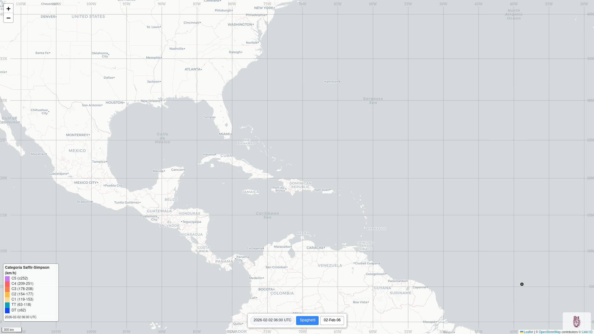
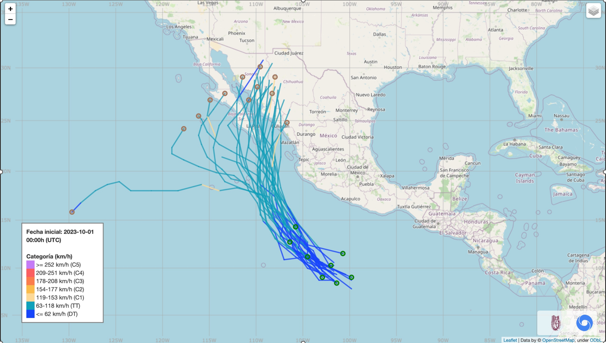
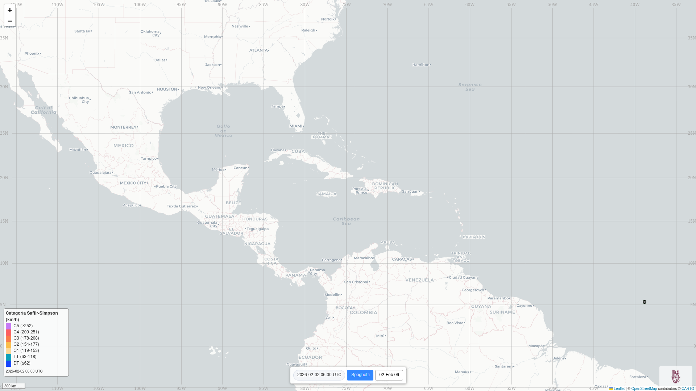
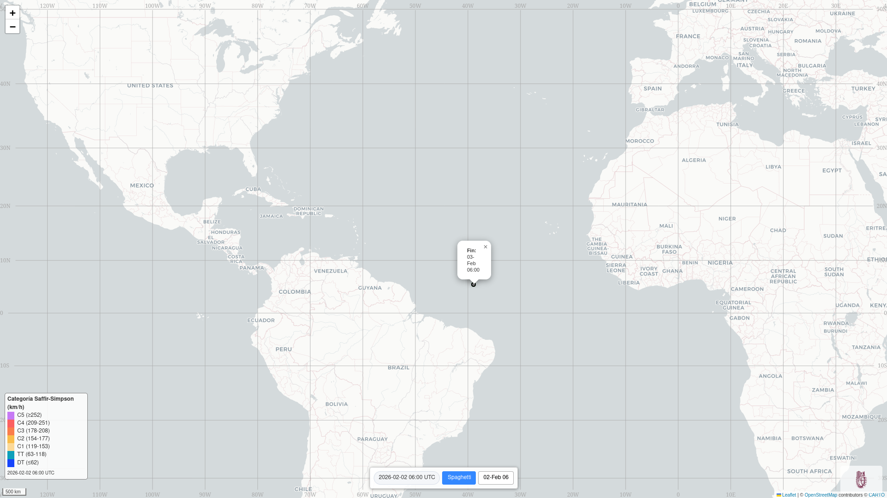
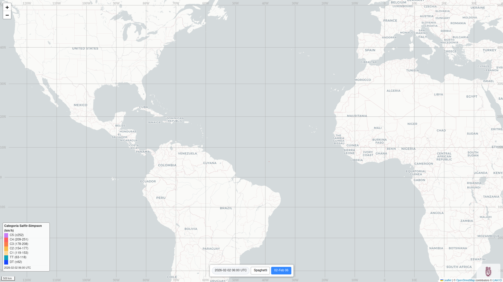
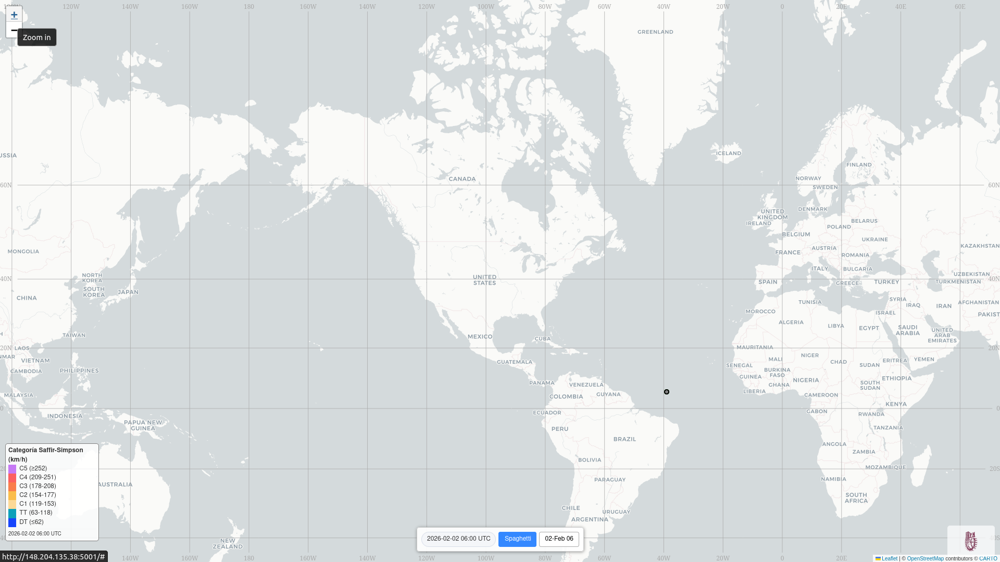
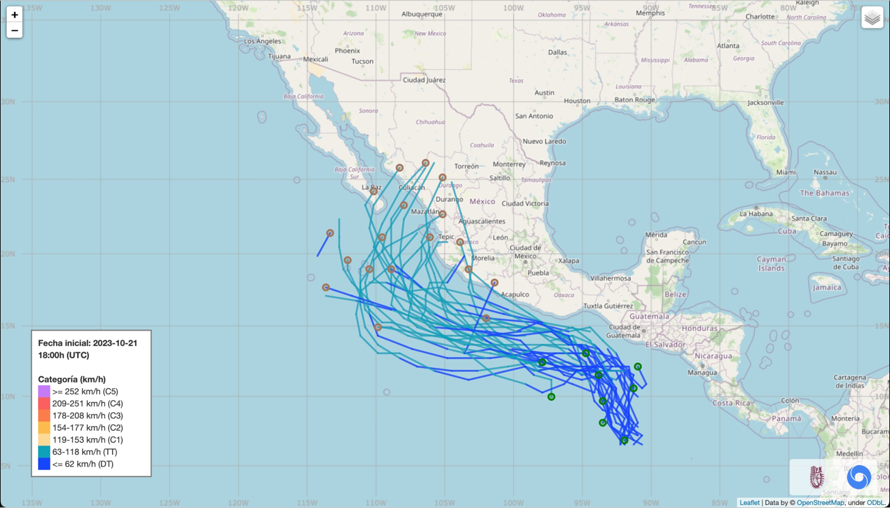

# System User's Manual

The Hurakán system facilitates the detection, monitoring, and forecasting of tropical cyclones through the visualization and analysis of potential meteorological phenomena, using detailed current information about variables such as temperature, pressure, humidity, and wind conditions in basins of interest and their temporal predicted evolution. The main objective is to increase awarness about potential tropical cyclones that could affect living conditions in coastal areas. The information entered into the system consists of meteorological forecasted information of the basins of interest at a certain resolution (0.25 degrees) obtained from the Google Earth Engine collection WeatherNext 2 [[1]](#reference-1), which is updated every six hours. This information is available year-round, so it can be used any day of the year. In the present version of the Hurakán system, the basins of interest include the Northeastern Pacific and the North Atlantic, both close to the coastal areas of Mexico in the Pacific and Atlantic Oceans, as shown in  Figure 1. Historically, hurrican season runs between May 15 and November 30 for the former and from June 1 to November 30 for the latter, with the highest incidence between August and September.

## Table of Contents
- [Requirements](#requirements)
- [Accessing Hurakán](#accessing)
- [Interface Description](#interface)
- [Available Information and Context Window](#available)
- [Activities](#activities)
- [Examples of Forecasting](#examples)
- [References](#references)
  

Figure 1. The defined regions of interest include Northeastern Pacific (blue) and the North Atlantic (green) basins.  

## Requirements
To properly visualize the possible trajectories and their cones of uncertainty for the probabilistic atmospheric data, the following are required:
- A web server with the Hurakán platform (see [Installation Manual](../README.md) ) posting at specific URL.
- A client web browser with Javascript enabled (Google Chrome 146, Safari 17, Microsoft Edge 145, or Mozilla Firefox 148 are recommended).
- System access credentials (the Hurakán system administrator can provide these credentials; see [Login and logout](#loginlogout)).

## Accessing Hurakán
Suppose the web server platform posts at URL https://hurakan.cicataqro.ipn.mx . In the **address bar** of the web browser write off `https://hurakan.cicataqro.ipn.mx` and press `<enter>`

List of possible URL to access services in Hurakán
- `https://hurakan.cicataqro.ipn.mx` - Initial access or `login` window
- `https://hurakan.cicataqro.ipn.mx/login` - `login` window
- `https://hurakan.cicataqro.ipn.mx/logout` - `logout` window
- `https://hurakan.cicataqro.ipn.mx/health` - `status` window

Hurakán mantains controlled access because of the metereological information and their possible consecuences. The adminstrator must give, for each person, a user name and password.
When accesing the initial window or the `login` window, the person must input their credentials in each input field, as shown in the Figure 2.

Figure 2. Login window. Credentials are provided by the system administrator.

After login, the next window will show the map for the data available and will allow interaction with the system.

When finish using Hurakán, the web browser can be closed or type in the browser address bar `https://hurakan.cicataqro.ipn.mx/logout`. A window will pop out and show what is illustred in Figure 3.

Figure 3. Logout window. Upon a succesful logout operation, this window will show up. 

## Interface description

<!-- The interface is divided into two main windows:

- Left side window or "selector". Here you can specify the date of the atmospheric data to be used (with possible predictions up to 15 days later, if supported by the data).

- Right-hand side window or "map". A world map is displayed showing the possible meteors that support the selected meteorological data.

### Selector Window
-->

A world map is displayed showing the possible meteors that support the selected meteorological data.

### Map Window

Map Window Elements:

Figure 4. The Saffir-Simpson scale showns several categories of wind speed with a key and color.

- Saffir-Simpson Category Speed ​​Scale. Displays meteor speeds using colors.
- Central panel with buttons. Displays the date of the data used, a Spaghetti button (to show all possible identified trajectories), and date buttons for each possible trajectory that could lead to a tropical cyclone (showing the date of the event, the possible trajectory using the Saffir-Simpson scale colors, the starting and ending points of that trajectory, and information at the ending point).

- World Map. It identifies the global position of trajectories, with a resolution of 10m to 1000km, allowing for precise trajectory tracking. The map center can be moved, and from there, zoom in (up to 10m) or zoom out (up to 1000km).
- There is an "Info" tab that summarizes all the possible identified trajectories.
  

## Available Information and Context Window
Given the probabilistic nature of its data, the Hurakán system generates possible tropical cyclone trajectories within a time window of up to 15 days for up to 50 different atmospheric scenarios with a lead time of 6 hours. The Spaghetti drawing in Figure 5 shows an example of such a visualization for Genevieve, a tropical storm formed on July 24, 2026, and still active as a hurricane by July 29. 

Figure 5. 20260729 Tropical Cyclone Genevieve. Example of the interactive hurricane system map. Given WeatherNext 2 [[1]](#reference-1) data for a date, such as July 29, 2026, the forecasted trajectories for an up to 15-day period are shown. Each trajectory corresponds to the forecasted evolution of a different atmospheric scenario. Each trajectory shows the storm's speed on a given  date in color, corresponding to the Saffir-Simpson Hurricane Wind Scale on the legend box in the bottom-left.

## Activities
In the Hurakán system, given the available information, the following activities can be performed:
- Select the date of the data to be reviewed
- For an event occurring in a certain date, the possible trajectories can be displayed using either Spaghetti or Cone of Uncertainty. The former occurs in any event when there is a prediction about a meteor having a certain trajectory. The latter occurs just in certain cases, basically when a cluster and classification analysis determine that an ensemble of trajectories are in a position to describe a tropical storm. Figure 6 illustrates the Spaghetti version. Note that each of the 50 atmospheric scenarios may contain an indetermined number of trajectories.

Figure 6. The Spaghetti button shows/occults the data group by individual forecast trajectories for the 50 atmospheric scenarios. Sometimes there aren't data to show, it depends on the metereological data from de day selected.

  - Spaghetti: The identified trajectories are shown, indicating the probable speed of the meteor, its probable starting and ending points given the specific date. To facilitate visualization, a trajectory can be selected at its ending point, and the date information at that point will be displayed.

Figure 7. Spaghetti info for each possible trajectory. The info is shown at the initial and ending point of the tarjectory.

  - Cone of Uncertainty. Given the trajectories for a timestamp, an area with wide equal to two standard deviations is shown spreading along the forecasted trajectory.
    

Figure 8. Overall possible trajectory for the date selected. The button(s) with the date(s) can shown a forecast of the trajectory ending in the date displayed.

Figure 9. The size of the scale in the map is shown in the bottom-left corner, below the Saffir-Simpson scale.

- Interactive visualization. On the map, the central point can be moved by right-clicking on the mouse and dragging the mouse icon around the screen. Simiarly, the view can be zoomed in or out by using either the free-wheel in some mouses or by clicking on the +/-  symbols at the upper-left corner of the screen. Note that the zoom range extends from 10 m to 1000 km. The current scale of the map is given by the horizontal width of the rectangle in the bottom-left corner of th window, just below the Saffir-Simpson Category box. 

Figure 10. The size of the scale in the map (shown as the horizontal length of the box at the bottom-left corner) can be reduced/increased with the `Zoom in`/`Zoom out` button at the top-right corner with the `+`/`-` sign or the mouse wheel.  

## Examples of detection and tracking

In this section, several cases are analyzed to demonstrate hurricane capabilities. To identify tropical cyclones, the nomenclature used by NOAA and NHC for the genesis of a tropical cyclone is employed, indicating the year (YYYY), the day of the year (DDD), the hemisphere (N or S), the latitude in degrees (LLL), and the longitude in degrees (HHH); the name assigned to the storm is also used.

### Tropical Cyclone 2023294N09264 (Otis)

Figure 11. 20231001 Tropical Cyclone Otis.

- Category 5 hurricane (SSHWS)
- Duration: October 22 – October 25
- Peak intensity: 165 mph (270 km/h) (1-min); 922 mbar (hPa) [from Wikipedia](https://en.wikipedia.org/wiki/Hurricane_Otis)

### Tropical Cyclone Lidia

Figure 12. 20231003 Tropical Cyclone Lidia.

- Category 4 hurricane (SSHWS)
- Duration: October 3 – October 11
- Peak intensity: 140 mph (220 km/h) (1-min); 942 mbar (hPa) [from Wikipedia](https://en.wikipedia.org/wiki/Hurricane_Lidia_(2023))

## References
<a id="reference-1">[1]</a> Ferran Alet and Ilan Price and Andrew El-Kadi and Dominic Masters and Stratis Markou and Tom R. Andersson and Jacklynn Stott and Remi Lam and Matthew Willson and Alvaro Sanchez-Gonzalez and Peter W. Battaglia (2025). *Skillful joint probabilistic weather forecasting from marginals*. Nature. [Link to Paper](https://arxiv.org/abs/2506.10772)

