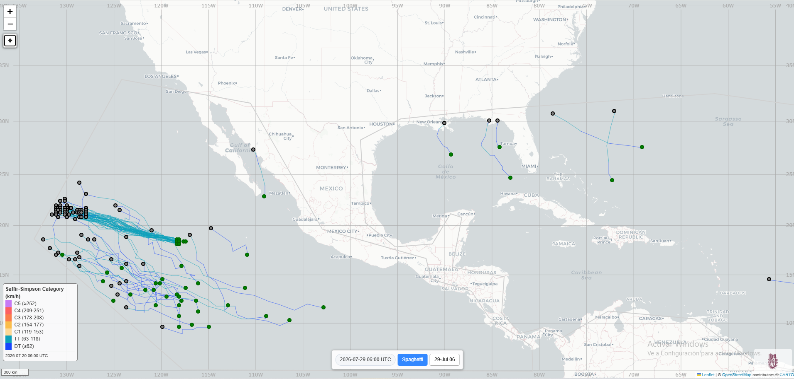

# System User's Manual

The Hurakán system facilitates the detection, monitoring, and forecasting of tropical cyclones through the visualization and analysis of potential meteorological phenomena, using detailed current information about variables such as temperature, pressure, humidity, and wind conditions in basins of interest and their temporal predicted evolution. The main objective is to increase awarness about potential tropical cyclones that could affect living conditions in coastal areas. The information entered into the system consists of meteorological forecasted information of the basins of interest at a certain resolution (0.25 degrees) obtained from the Google Earth Engine collection WeatherNext 2 [[1]](#reference-1), which is updated every six hours. This information is available year-round, so it can be used any day of the year. In the present version of the Hurakán system, the basins of interest include the Northeastern Pacific and the North Atlantic, both close to the coastal areas of Mexico in the Pacific and Atlantic Oceans, as shown in  Figure 1. Historically, hurrican season runs between May 15 and November 30 for the former and from June 1 to November 30 for the latter, with the highest incidence between August and September.

## Table of Contents
- [Requirements](#requirements)
- [Accessing Hurakán](#accessing)
- [Interface Description](#interface)
- [Activities](#activities)
- [Examples of Forecasting](#examples)
- [References](#references)
  

Figure 1. The defined regions of interest include Northeastern Pacific (blue) and the North Atlantic (green) basins.  

## Requirements
To properly visualize the possible trajectories and their cones of uncertainty for the probabilistic atmospheric data, the following are required:
- A web server with the Hurakán platform (see [Installation Manual](../README.md) ) posting at specific URL.
- A client web browser with Javascript enabled (Google Chrome 146, Safari 17, Microsoft Edge 145, or Mozilla Firefox 148 are recommended).
- System access credentials (the Hurakán system administrator can provide these credentials; see [Accessing Hurakán](#accessing)).

## Accessing Hurakán
Suppose the web server platform posts at URL https://hurakan.cicataqro.ipn.mx . In the **address bar** of the web browser write off `https://hurakan.cicataqro.ipn.mx` and press `<enter>`

List of possible URL to access services in Hurakán
- `https://hurakan.cicataqro.ipn.mx` - Initial access or `login` window
- `https://hurakan.cicataqro.ipn.mx/login` - `login` window
- `https://hurakan.cicataqro.ipn.mx/logout` - `logout` window
- `https://hurakan.cicataqro.ipn.mx/health` - `status` window

Hurakán mantains controlled access because of the metereological information and their possible consecuences. The adminstrator must give, for each person, a user name and password.
When accesing the initial window or the `login` window, the person must input their credentials in each input field, as shown in the Figure 2(a).
After login, the next window will show the map for the data available and will allow interaction with the system.
When finish using Hurakán, the web browser can be closed or type in the browser address bar `https://hurakan.cicataqro.ipn.mx/logout`. A window will pop out and show what is illustred in Figure 2(b).

|  *(a) Login screen* |  *(b) Logout screen* |
| :---: | :---: |
|  |  |

Figure 2. Login/Logout window. Credentials are provided by the system administrator.

## Interface description

Given the probabilistic nature of its data, the Hurakán system generates possible tropical cyclone trajectories within a time window of up to 15 days for up to 50 different atmospheric scenarios with a lead time of 6 hours. The Spaghetti drawing in Figure 5 shows an example of such a visualization for Genevieve, a tropical storm formed on July 24, 2026, and still active as a hurricane by July 29.  The interface includes the elements included in Figure 4.

Figure 4. Tropical Cyclone Genevieve. Example of the interactive hurakán system map. Given WeatherNext 2 atmospheric forecasted scenarios for a date, such as July 29, 2026, the estimated trajectories for an up to 15-day period are shown. Each trajectory corresponds to the forecasted evolution of a different atmospheric scenario. Each trajectory shows the storm's speed on a given  date in color, corresponding to the Saffir-Simpson Hurricane Wind Scale on the legend box in the bottom-left.

- World Map. It identifies the global position of trajectories, with a resolution of 10m to 1000km, allowing for precise trajectory tracking. The map center can be moved, and from there, zoom in (up to 10m) or zoom out (up to 1000km).
- Saffir-Simpson Category Box. Displays the color associated with different wind speeds. Each color distinguishes between *DT* (TD, tropical depression), *TT* (TS, tropical storm), *Ci* (hurricane categories 1, ..., 5) and provide their velocity ranges in km/h.
- Central Panel. This panel provides the current WeatherNext 2 data being processsed in Coordinate Universal Time (UTC) standard. The central part of Mexico is UTC-6, now that the country does not shift times during Spring and Autum. It also includes a *Spaghetti* button, which can toggle to show the identified trajectories and the most probable overall trajectory for a tropical cyclone that has been deemed as strong or stronger than a tropical storm. In addition, it includes date buttons for each possible trajectory cluster that has been deemed mature enough to be classified as a tropical storm or stronger. The trajectories show the forecasted Saffir-Simpson scale colors, the starting and ending points of that trajectory, and information at the ending point. Note that the velocity of winds correspond to the average over a cell with a 0.25 degrees resolution. Therefore, the wind speed may be a conservative estimate respect to the strongest wind gust that may be observed.
- Zoom Controls. The map view can be zoomed in or out by using either the free-wheel in some mouses or by clicking on the +/-  symbols at the upper-left corner of the screen. Note that the zoom range extends from 10 m to 1000 km.
- Map Scale. The current scale of the map is given by the horizontal width of the rectangle in the bottom-left corner of the window, just below the Saffir-Simpson Category box. 
- Spaghetti: The identified trajectories are shown, indicating the probable speed through it, its probable starting and ending points given the specific date (see Figure 4). To facilitate visualization, a trajectory can be selected at its ending point (green at the start and a dark gray point at the end). For an event occurring in a certain date, the possible trajectories can be displayed turning on and off the Spaghetti botton. The default will show the spaghetties.  The latter occurs just in certain cases, basically when a cluster and classification analysis determine that an ensemble of trajectories are in a position to describe a tropical storm.  Note that each of the 50 atmospheric scenarios may contain an indetermined number of trajectories.
- Cone of Uncertainty. If the Spaghetti boton is turned on, there will be a Cone of Uncertainty, the most likely trajectory and its band of uncertainty with two standard deviations by side. This  occurs in any event when an ensemble of trajectories form a structure mature enough to be as strong or stronger than a tropical storm. In such a case, there is a prediction about a tropical cyclone having a certain trajectory. Given the trajectories for a timestamp, an area with wide equal to two standard deviations is shown spreading along the forecasted trajectory.
- Region of Interest (ROI) Outline. The boundaries for the ROI are barely described in the maps. The aim is to provide the boundary of the regions for which WeatherNext 2 data is being downloaded while trying not to be obtrusive with the rest of the information being displayed. 

Figure 5. Tropical Cyclone Norma. Norma de formed on October 15, 2023, ane evolved into a Category 4 hurricane. It made landfall on Baja California Sur as a Category 1 hurricane. After crossing the state, it re-emerged over the Mar de Cortez and made landfall on Sinaloa as a tropical depression. Here, we show the most likely trajectory and the cone of uncertainty. 

## Activities
In the Hurakán system, given the available information, the following activities can be performed:
- Date selection. If there is a tropical cyclone that has been deemed as strong or stronger than a tropical storm, there will be one or more dates to choose from.  Select the date of the data to be reviewed. In such a case, the most likely trajectory, as a dashed black line with an arrow at its end-point will be displayed. Clicking the Spaghetti will toggle back to trajectories.
- Initial-Final date. For a trajectory it is possible to click at its end-pints to display the date its probable starting or ending date.
- Interactive visualization. On the map, the central point can be moved by right-clicking on the mouse and dragging the mouse icon around the screen.
- Zooming in/out. The view can be zoomed in or out by using either the free-wheel in some mouses or by clicking on the +/-  symbols at the upper-left corner of the screen. Note that the zoom range extends from 10 m to 1000 km. The current scale of the map is given by the horizontal width of the rectangle in the bottom-left corner of th window, just below the Saffir-Simpson Category box.
- View centering. When clicked, the symbol below the +/- symbols in the upper-left corner permits to center the map in Mexico at 300 km scale. 

## Examples of detection and tracking

In this section, several cases are analyzed to demonstrate hurricane capabilities. To identify tropical cyclones, the nomenclature used by NOAA and NHC for the genesis of a tropical cyclone is employed, indicating the year (YYYY), the day of the year (DDD), the hemisphere (N or S), the latitude in degrees (LLL), and the longitude in degrees (HHH); the name assigned to the storm is also used.

### Tropical Cyclone 2023294N09264 (Otis)

Figure 11. 20231001 Tropical Cyclone Otis.

- Category 5 hurricane (SSHWS)
- Duration: October 22 – October 25
- Peak intensity: 165 mph (270 km/h) (1-min); 922 mbar (hPa) [from Wikipedia](https://en.wikipedia.org/wiki/Hurricane_Otis)

### Tropical Cyclone Lidia

Figure 12. 20231003 Tropical Cyclone Lidia.

- Category 4 hurricane (SSHWS)
- Duration: October 3 – October 11
- Peak intensity: 140 mph (220 km/h) (1-min); 942 mbar (hPa) [from Wikipedia](https://en.wikipedia.org/wiki/Hurricane_Lidia_(2023))

## References
<a id="reference-1">[1]</a> Ferran Alet and Ilan Price and Andrew El-Kadi and Dominic Masters and Stratis Markou and Tom R. Andersson and Jacklynn Stott and Remi Lam and Matthew Willson and Alvaro Sanchez-Gonzalez and Peter W. Battaglia (2025). *Skillful joint probabilistic weather forecasting from marginals*. Nature. [Link to Paper](https://arxiv.org/abs/2506.10772)

