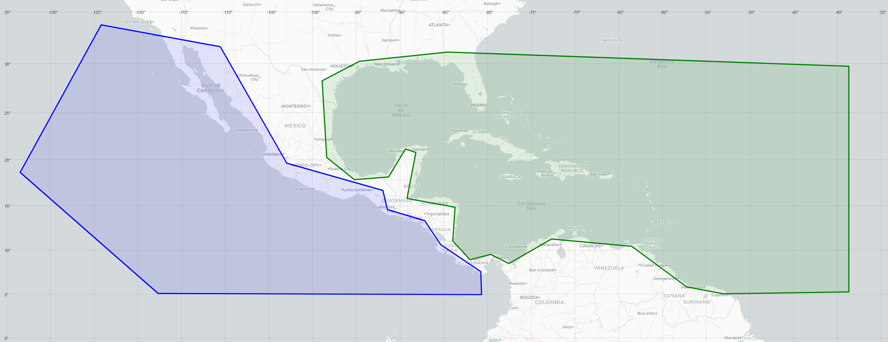
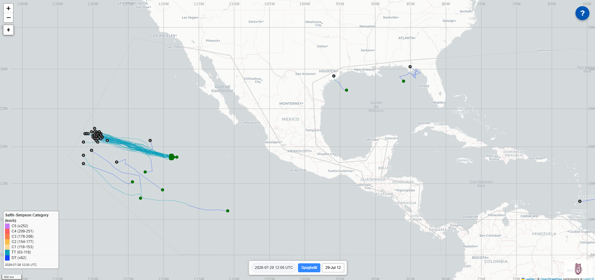
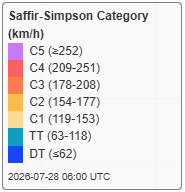
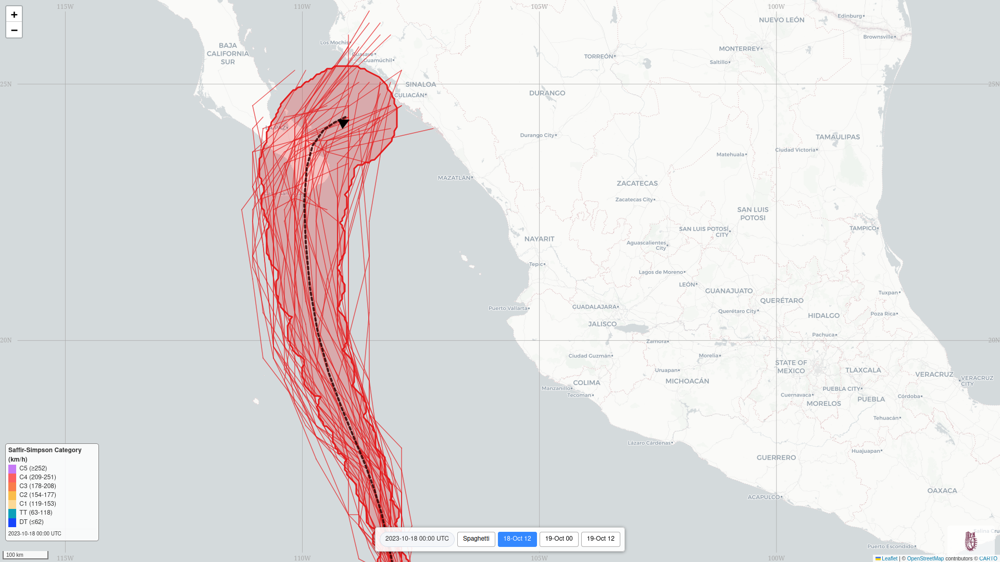
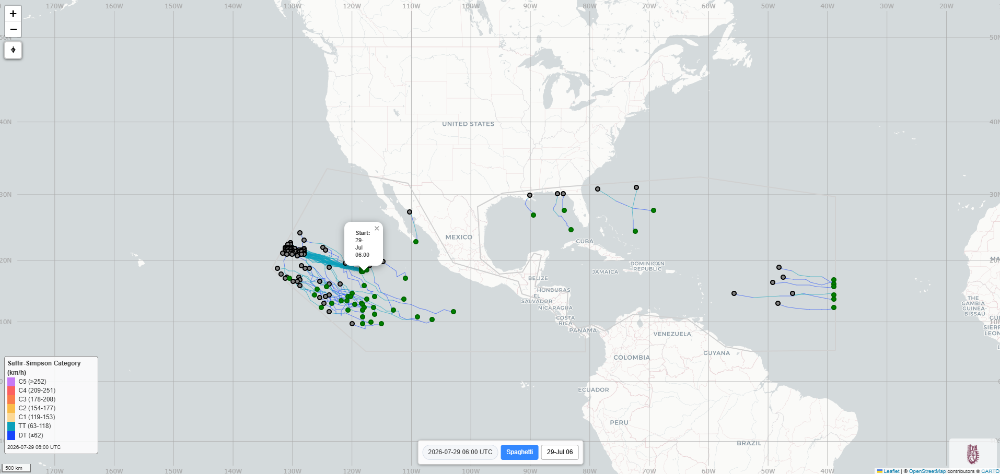
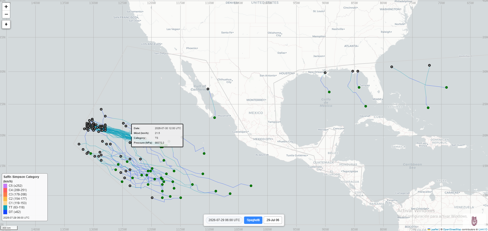

# System User's Manual

The Hurakán system facilitates the detection, monitoring, and forecasting of tropical cyclones through the visualization and analysis of potential meteorological phenomena. It provides detailed current and forecast information on variables such as temperature, pressure, humidity, and wind conditions in the basins of interest, together with their predicted evolution over time. The main objective is to increase awareness of potential tropical cyclones that could affect living conditions in coastal areas. The system uses meteorological forecast information for the basins of interest at a resolution of 0.25 degrees, obtained from the Google Earth Engine WeatherNext 2 collection [[1]](#reference-1), which is updated every six hours. This information is available year-round, so that the system can be used on any day of the year. In the current version of Hurakán, the basins of interest include the Northeastern Pacific and the North Atlantic, both near Mexico's Pacific and Atlantic coastal areas, as shown in Figure 1. Historically, hurricane season runs from May 15 to November 30 in the former and from June 1 to November 30 in the latter, with the highest incidence between August and September.

## Table of Contents
- [Requirements](#requirements)
- [Accessing Hurakán](#accessing)
- [Interface Description](#interface)
- [Examples of Forecasting](#examples)
- [Authors](#authors)
- [References](#references)

Figure 1. The defined regions of interest include the Northeastern Pacific (blue) and North Atlantic (green) basins.

## Requirements

To properly visualize possible trajectories and their cones of uncertainty from probabilistic atmospheric data, the following are required:
- A web server hosting the Hurakán platform at a specific URL (see the [Installation Manual](../README.md)).
- A client web browser with JavaScript enabled (Google Chrome 146, Safari 17, Microsoft Edge 145, or Mozilla Firefox 148 are recommended).
- System access credentials (the Hurakán system administrator can provide these credentials; see [Accessing Hurakán](#accessing)).

## Accessing Hurakán

Suppose the web server hosts the platform at `https://hurakan.cicataqro.ipn.mx`. In the web browser's **address bar**, type `https://hurakan.cicataqro.ipn.mx` and press `<Enter>`.

List of URLs for accessing Hurakán services:
- `https://hurakan.cicataqro.ipn.mx` - Initial access or `login` window.
- `https://hurakan.cicataqro.ipn.mx/login` - `login` window.
- `https://hurakan.cicataqro.ipn.mx/logout` - `logout` window.
- `https://hurakan.cicataqro.ipn.mx/health` - `status` window.

Hurakán maintains controlled access because of the meteorological information it provides and its possible consequences. The administrator must provide each user with a username and password.

When accessing the initial window or the `login` window, the user must enter their credentials in the corresponding input fields, as shown in Figure 2(a). After logging in, the next window displays the map with the available data and allows interaction with the system.

When finished using Hurakán, the user can close the web browser or enter `https://hurakan.cicataqro.ipn.mx/logout` in the browser's address bar. A window will appear, as illustrated in Figure 2(b).

| *(a) Login screen* | *(b) Logout screen* |
| :---: | :---: |
|  |  |

Figure 2. Login/logout window. The system administrator provides credentials.

## Interface Description

Given the probabilistic nature of its data, the Hurakán system generates possible tropical cyclone trajectories within a time window of up to 15 days for up to 50 different atmospheric scenarios, with a lead-time interval of 6 hours. The spaghetti plot in Figure 4 shows an example of this visualization for Genevieve, a tropical storm that formed on July 24, 2026, and was still active as a hurricane on July 29. The interface includes the passive and active elements shown in Figure 4.

Figure 4. Tropical Cyclone Genevieve. Example of the interactive Hurakán system map. For a date such as July 29, 2026, estimated trajectories for up to 15 days are shown for two WeatherNext 2 atmospheric forecast scenarios. Each trajectory corresponds to the forecast evolution of a different atmospheric scenario. The color of each trajectory indicates the storm's wind speed on a given date according to the Saffir-Simpson Hurricane Wind Scale shown in the legend box at the bottom-left.

### Passive Components
- **World Map.** It shows the geographic position of the trajectories, with a scale ranging from 10 m to 1000 km, allowing precise trajectory tracking. The map center can be moved, and the view can be zoomed in to 10 m or out to 1000 km.
- **Saffir-Simpson Category Box.**
  
       It displays the colors associated with different wind speeds. Each color distinguishes among *DT* (TD, tropical depression), *TT* (TS, tropical storm), and *Ci* (hurricane Categories 1 through 5), and provides the corresponding wind speed ranges in km/h.
- **Map Scale.** The current map scale is indicated by the horizontal width of the rectangle at the bottom-left corner of the window, just below the Saffir-Simpson Category Box.
- **Region of Interest (ROI) Outline.** The ROI boundaries (see Figure 1) are faintly outlined on the maps (Figure 4). Their purpose is to indicate the boundaries of the regions for which WeatherNext 2 data are downloaded while remaining unobtrusive relative to the other displayed information.
- **User's Manual Information.** A link to the present document is added to the map. This offer the possibility of bringing a detailed description of the different elements presented and how to use them more effectively. 

Figure 5. Tropical Cyclone Norma. Norma formed on October 15, 2023, and evolved into a Category 4 hurricane. It made landfall on Baja California Sur as a Category 1 hurricane. After crossing the state, it re-emerged over the Sea of Cortez and made landfall in Sinaloa as a tropical depression. Here, we show the most likely trajectory and the cone of uncertainty.

### Active Components

In the Hurakán system, the following activities can be performed using the available information:
- **Central Panel.**
  
  This panel shows the trajectories extracted from the atmospheric scenarios and the corresponding time in Coordinated Universal Time (UTC). Central Mexico uses UTC-6 and does not change clocks in spring or autumn.
  The *Spaghetti* button toggles between the individual ensemble trajectories and the most probable overall trajectory for a system classified as a tropical storm or stronger. Date buttons are provided for each trajectory cluster considered mature enough for this classification.
  By default, the spaghetti trajectories are displayed. Each track shows the forecast wind speed using the Saffir-Simpson colors, together with its probable starting and ending points for the selected date. The starting point is green, and the ending point is dark gray and can be selected to display additional information. This view is available only when the cluster and classification analyses identify an ensemble capable of describing a tropical storm or stronger.
  Each of the 50 atmospheric scenarios may contain an undetermined number of trajectories. Wind speeds represent averages over 0.25-degree cells and may therefore be lower than the strongest observed gusts.
  - **Date Selection.** If a tropical cyclone has been classified as a tropical storm or stronger, one or more dates will be available for selection. Select the date of the data to be reviewed. In this case, the most likely trajectory is displayed as a dashed black line with an arrow at its endpoint. Clicking *Spaghetti* toggles back to the trajectory view.
  - **Cone of Uncertainty View.** When the *Spaghetti* button is turned on, the cone of uncertainty, the most likely trajectory, and an uncertainty band extending two standard deviations on either side are displayed (see Figure 5). This occurs when an ensemble of trajectories forms a structure mature enough to represent a tropical storm or stronger. In this case, the system predicts a tropical cyclone with a particular trajectory. For the trajectories associated with a given timestamp, an area with a width equal to two standard deviations is shown along the forecast trajectory.
- **Zoom Controls.** The map view can be zoomed in or out using the mouse wheel or by clicking the `+` and `-` symbols at the upper-left corner of the screen. The zoom range extends from 10 m to 1000 km. The current map scale is indicated by the horizontal width of the rectangle at the bottom-left corner of the window, just below the Saffir-Simpson Category Box.
- **View Centering Button.** When clicked, the symbol below the `+` and `-` controls at the upper-left corner. this icon centers the map on Mexico at a 300 km scale.

- **Trajectory Information.** For a trajectory, the user can click its endpoints to display its probable starting or ending date (see Figure 6). Users may also click individual trajectories to view forecast information at intermediate points along a tropical cyclone’s potential track. This information includes the UTC date and time, wind speed in km/h, Saffir–Simpson category, and mean sea-level pressure in hPa.
- **Interactive Visualization.** The map center can be moved by right-clicking and dragging the mouse.

Figure 6. Trajectories end-point dates. Clicking on trajectory end-points will result in a pop-out window displaying UTC date and time.

Figure 7. Intra-trajectory information. As they forecast the trajectory of tropical cyclones, clicking along the trajectory will generate relevant information about the tropical cyclone at that point in space-time.

## Examples of Detection and Tracking

This section analyzes several cases to demonstrate the system's hurricane detection and tracking capabilities. Tropical cyclones are identified using the NOAA and NHC nomenclature for tropical cyclone genesis, which indicates the year (YYYY), the day of the year (DDD), the hemisphere (N or S), the latitude in degrees (LLL), and the longitude in degrees (HHH). The assigned storm name is also used.

### Tropical Cyclone 2023294N09264 (Otis)

Figure 8. 20231001 Tropical Cyclone Otis.

- Category 5 hurricane (SSHWS)
- Duration: October 22–October 25
- Peak intensity: 165 mph (270 km/h) (1-min); 922 mbar (hPa) [from Wikipedia](https://en.wikipedia.org/wiki/Hurricane_Otis)

### Tropical Cyclone Lidia

Figure 9. 20231003 Tropical Cyclone Lidia.

- Category 4 hurricane (SSHWS)
- Duration: October 3–October 11
- Peak intensity: 140 mph (220 km/h) (1-min); 942 mbar (hPa) [from Wikipedia](https://en.wikipedia.org/wiki/Hurricane_Lidia_(2023))

## Authors 
The project has benefited by the participation of the following [contributors](https://github.com/joaquinsalas/hurakan/blob/main/acknowledgments/acknowledgments.md).

## References

<a id="reference-1">[1]</a> Ferran Alet, Ilan Price, Andrew El-Kadi, Dominic Masters, Stratis Markou, Tom R. Andersson, Jacklynn Stott, Remi Lam, Matthew Willson, Alvaro Sanchez-Gonzalez, and Peter W. Battaglia (2025). *Skillful joint probabilistic weather forecasting from marginals*. Nature. [Link to Paper](https://arxiv.org/abs/2506.10772)
